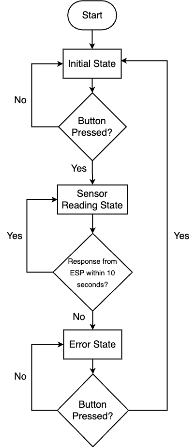
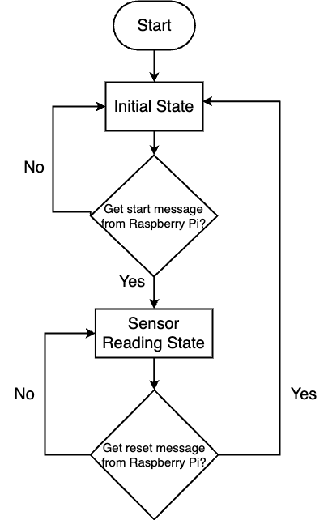

# IoT Light Sensor Communication

## Overview

This project is designed to demonstrate the communication between a Raspberry Pi and an ESP8266 microcontroller using a photoresistor (analog light sensor). The Raspberry Pi is equipped with a button and four LEDs (Red, Yellow, Green, and White). The ESP8266 collects light sensor data and communicates it to the Raspberry Pi.

[Watch Demo Video](https://drive.google.com/file/d/1WrScIqkv76lKfiEBr7FWv31vHqEYWnRY/view?usp=drive_link)

## Components

- Raspberry Pi
- ESP8266
- Photoresistor (Light Sensor)
- LEDs (Red, Yellow, Green, and White)
- LCD
- Buttons (Start/Reset, UDP Packet Loss Simulation)

## Repository Structure

- `Raspberry.py`: Contains the Raspberry Pi Python code.
- `ESP8266/ESP8266.ino`: Contains the ESP8266 Arduino code.
- `ESP8266/WiFiCredentials.h`: Stores the WiFi SSID and password for ESP8266.

## Functionality

The system operates as follows:

1. **Initialization**: When the button on the Raspberry Pi is pressed, it activates the white LED and sends a UDP message to the ESP8266 to establish communication.

2. **ESP8266 Response**: Upon receiving the first UDP message, the ESP8266 starts the following processes:
   - Flashing its onboard LED every 0.5 seconds.
   - Collecting light sensor values every 1 second.
   - Sending UDP responses with the average light sensor value every 2 seconds after collecting 5 seconds' worth of data.

3. **Raspberry Pi Reaction**: When the Raspberry Pi receives a response containing light sensor data, it controls its RGB LEDs based on the received value. It turns on one LED for LOW, two LEDs for MEDIUM, and all three LEDs for HIGH, with threshold values that can be configured.

4. **Error Handling**: If the Raspberry Pi hasn't received a message from the ESP8266 for 10 seconds, it flashes the white LED to indicate an error. It does not attempt to reestablish the connection until the button is pressed again.

5. **Reset**: Pressing the button on the Raspberry Pi again sends a different UDP message to the ESP8266 and turns off all RGBW LEDs. The ESP8266 stops collecting and sending sensor readings, turns off its onboard LED, and both devices return to their initial state.

### Raspberry Pi Flowchart ###

### ESP8266 Flowchart

## Schematic Description

**ESP8266**
1. The LCD is powered by the ESP8266 through its VIN pin.
2. IC2 communication is established via SCL and SDA pins, connected to D1 and D2.
3. The photoresistor is connected to the A0 pin with a resistor in between.

**Raspberry Pi**
1. A push button is connected to the RXD0 pin with a pull-down resistor.
2. The white LED is connected to the GPIO 18 pin with a resistor.
3. Three LEDs (green, yellow, red) are connected to the GPIO 17, 27, and 22 with resistors.

## Getting Started

1. Clone this repository to your local machine.
2. Upload the Raspberry Pi and ESP8266 code to their respective devices.
3. Build the circuit based on the provided schematics.
4. Replaced the WiFi SSID and password in WiFiCredentials.h and run the ESP8266 code.
5. Setup the IP Address that shows on LCD in Raspberry.Py and run the code on the Pi.
6. The Pi and ESP8266 should now be ready to communicate as described.

## Dependencies

- Python (for the Raspberry Pi)
- Arduino IDE (for the ESP8266)

## Acknowledgments

- This project was originally designed as a school project by Professor Quoc-Viet Dang.
- We would like to express our gratitude to [Professor's Name] for their guidance and mentorship throughout this project.